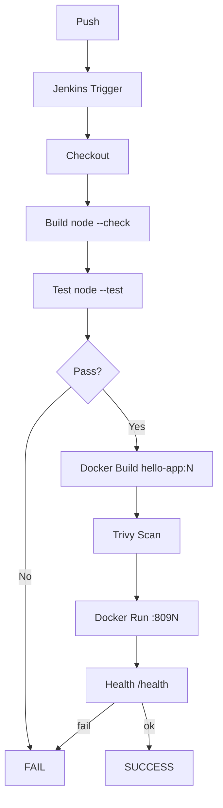

# Jenkins CI/CD Pipeline

Jenkins pipeline that builds, tests, scans, containerizes, and health-checks a Node.js application — Jenkins controller runs in Docker with Configuration as Code.

## Overview

This repository implements a complete CI/CD loop triggered from GitHub. A zero-dependency Node.js service (`app/` using only the built-in `http` module) is validated, tested with `node:test`, scanned with Trivy, built into an immutable image `hello-app:BUILD_NUMBER`, run as an isolated container on a unique host port `809N`, and gated by a `/health` check. Every build is traceable to a commit via `GIT_COMMIT` and cleaned up automatically.

**Real-world problem it solves:** manual releases are irreproducible, ungated, and untraceable — this pipeline makes builds immutable, verified, and auditable.

```
Git push --> Jenkins (Jenkinsfile) --> Checkout --> Build & Validate --> Test
         --> Docker Build --> Security Scan --> Docker Run --> Health Check --> Cleanup
```

## Architecture

| Component | Role |
|---|---|
| GitHub | Source of truth; webhook/poll trigger |
| Jenkins (container) | Orchestrates `Jenkinsfile` |
| Docker host daemon | Builds/runs app via `/var/run/docker.sock` (DooD) |
| hello-app (Node) | `GET /`, `/health`, `/api/message` |

Jenkins controller: `jenkins/docker-compose.yml` (ports 8080 + 50000, `jenkins_home` volume, JCasC `jenkins.yaml`, Docker CLI + Node inside image).



## Technologies

| Technology | Purpose |
|---|---|
| Git / GitHub | VCS and trigger |
| Jenkins (declarative) | Pipeline orchestration, Blue Ocean, JCasC |
| Docker + Compose | Build/run app and Jenkins |
| Trivy | Image vulnerability scanning (report-only) |
| Node.js `node:test` | App + tests (zero deps) |
| Bash | `run-pipeline.sh`, `healthcheck.sh` |

## Features

- Declarative `Jenkinsfile` with `options` (timestamps, log rotator, timeout, `disableConcurrentBuilds`) and `post` (always cleanup)
- Per-build isolation: image `hello-app:BUILD_NUMBER`, container `hello-app-N`, host port `809N`
- Build-time validation `node --check server.js`; tests auto-discover `test/`
- Trivy stage skips gracefully if unavailable, scans filesystem + image when present
- Health gate `curl /health` must contain `"status":"ok"`
- JCasC (`jenkins/config-as-code/jenkins.yaml`) and `plugins.txt` (baked at image build)

## Prerequisites

- Docker Engine 24+ with Compose v2
- Git
- ~2–4 GB RAM
- Node 18+ optional (Jenkins image ships Node 22)

## Setup

```bash
git clone <this-repo> && cd jenkins-cicd-pipeline
docker compose -f jenkins/docker-compose.yml up -d --build
bash scripts/run-pipeline.sh   # pre-flight checks + wait + password hint
docker exec jenkins cat /var/jenkins_home/secrets/initialAdminPassword
# Open http://localhost:8080, install suggested plugins, create admin
# Create Pipeline (or Multibranch) job, SCM → this repo, Script Path Jenkinsfile, Build Now
```

Full guide: `docs/setup.md`.

## Configuration

- `Jenkinsfile` environment: `APP_IMAGE=hello-app`, `APP_IMAGE_TAG=${BUILD_NUMBER}`, `HOST_PORT=809${BUILD_NUMBER%10}`, `HEALTH_URL=http://localhost:809N/health`
- `.env.example` → `.env` (gitignored): `JENKINS_HTTP_PORT`, `JENKINS_ADMIN_PASSWORD`, `GITHUB_REPO_URL`, `TRIVY_IMAGE`
- `jenkins/config-as-code/jenkins.yaml`: `systemMessage`, `numExecutors: 2`, credentials placeholders `github-creds` / `docker-registry-creds` (referenced by ID, stored in Jenkins Credentials store — never in file)
- `jenkins/plugins.txt`: `workflow-aggregator`, `git`, `docker-workflow`, `blueocean`, `configuration-as-code`, etc.

## Deployment

This repo deploys **locally** via Docker run (no cloud). Each build:

```bash
docker build -t hello-app:42 ./app
docker run -d --name hello-app-42 -p 8092:3000 hello-app:42
curl -s http://localhost:8092/health  # {"status":"ok"}
docker rm -f hello-app-42
```

Production equivalent: push `hello-app:42` to a registry (GHCR/ECR) and pull from deploy hosts.

## CI/CD

Pipeline stages (see `Jenkinsfile`):

1. **Checkout** — `checkout scm` (fallback for freestyle)
2. **Build & Validate** — `node --version`, `node --check server.js`
3. **Test** — `node --test`
4. **Docker Build** — `docker build -t hello-app:TAG ./app`
5. **Security Check** — `trivy filesystem` + `trivy image` (or `docker run aquasec/trivy`)
6. **Docker Run** — unique container, wait loop `curl -sf HEALTH_URL`
7. **Health Check** — `grep '"status":"ok"'`
8. **Cleanup** — `docker rm -f` + `docker image rm`

`post { always { docker rm }}` ensures no leaked containers.

## Testing

```bash
cd app
node --check server.js
node --test                # 5 tests (example-failing.js green by default)
PORT=34567 node --test     # if host 3000 occupied (e.g., Grafana)
bash ../scripts/healthcheck.sh http://localhost:8091/health
```

Toggle `app/test/example-failing.js` `EXPECTED = 'fail'` to demo a red build.

## Monitoring / Logging

- Jenkins console + Blue Ocean per-stage view
- `docker logs --tail 100 jenkins`
- `docker logs hello-app-N`
- `docker stats`

## Security

- Credentials by ID only (`github-creds`, `docker-registry-creds`), stored encrypted in Jenkins; placeholders in `jenkins.yaml`/`Jenkinsfile`
- `.env` gitignored; `.env.example` only placeholders
- App `USER node` (non-root), Jenkins `USER jenkins`
- `docker.sock` mount is root-equivalent — documented in `jenkins/docker-compose.yml`, restricted to trusted local demo (alternative: DinD/ephemeral agents)
- Trivy scan stage is report-only (`--exit-code 0`); enforce with `--exit-code 1` and add `gitleaks` for stricter gates

## Cleanup

```bash
docker compose -f jenkins/docker-compose.yml down -v   # removes jenkins_home
docker rm -f hello-app-42 2>/dev/null || true
docker image prune -f
```

## Project Structure

```
jenkins-cicd-pipeline/
├── README.md
├── Jenkinsfile
├── .env.example
├── .dockerignore
├── .gitignore
├── app/
│   ├── Dockerfile
│   ├── package.json
│   ├── server.js
│   └── test/
│       ├── test.js
│       └── example-failing.js
├── jenkins/
│   ├── Dockerfile
│   ├── docker-compose.yml
│   ├── plugins.txt
│   └── config-as-code/jenkins.yaml
├── scripts/
│   ├── run-pipeline.sh
│   └── healthcheck.sh
├── docs/
├── diagrams/
└── screenshots/
```

## Future Improvements

- Push images to GHCR tagged by git SHA
- Archive artifacts (`health-output.json`, JUnit) and publish
- GitHub webhook `github-webhook/` instead of poll
- Notifications (Slack/email) via `post`
- DinD/ephemeral agents to remove socket risk
- Enforce Trivy gate and add secret scanning
