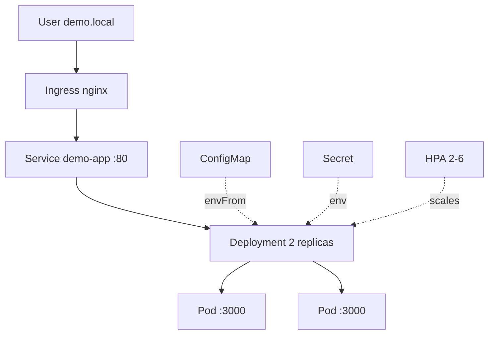

# Kubernetes Application Deployment

Production-style Kubernetes manifests for a Node.js web application — Deployment, Service, ConfigMap, Secret, Ingress, and HPA with liveness/readiness probes.

## Overview

This repository deploys a zero-dependency Node.js service to any Kubernetes cluster (local Kind/minikube/Docker Desktop or managed EKS/GKE/AKS). The app exposes `GET /`, `/health`, `/ready`, and `/api/message` and is fronted by a ClusterIP Service and an nginx Ingress. Configuration is externalized via ConfigMap, secrets via Secret, and scaling via HPA.

**Real-world problem it solves:** containerizing an app is not enough — production requires declarative, versioned Kubernetes objects with health probes, resource limits, security contexts, and horizontal autoscaling.

```
Internet --> Ingress (nginx, host demo.local) --> Service :80 --> Deployment (2 replicas) --> Pod :3000
                ConfigMap (PORT, APP_VERSION) + Secret (api-key) --> Pod env
                HPA (cpu 70% / mem 80% → 2–6 replicas)
```

## Architecture



Manifests in `k8s/` are intended to be applied with `kubectl apply -f k8s/` or via GitOps (Argo CD/Flux).

## Technologies

| Technology | Purpose |
|---|---|
| Kubernetes | Orchestration (Deployment, Service, Ingress, HPA) |
| Docker | Container image (`ghcr.io/your-org/kubernetes-demo-app:1.0.0`) |
| Node.js | Demo app (zero deps, health endpoints) |
| nginx Ingress | External traffic routing |
| kubectl / Kind | Cluster interaction |

## Features

- **Deployment** rolling update (`maxSurge 1`, `maxUnavailable 0`), 2 replicas, non-root `runAsUser 10001`, `readOnlyRootFilesystem`, `drop ALL` capabilities
- **Liveness** `/health` and **readiness** `/ready` HTTP probes with resource requests/limits (`100m/128Mi` → `300m/256Mi`)
- **ConfigMap + Secret** externalized config; Secret holds base64 placeholder `api-key`
- **Service** ClusterIP `80 → 3000`
- **Ingress** `host: demo.local`, `path: /` → Service
- **HPA** `min 2 / max 6` on CPU 70% and memory 80%

## Prerequisites

- Docker
- kubectl (v1.28+)
- Cluster: Kind, minikube, Docker Desktop K8s, or cloud (EKS/GKE/AKS)
- Optional: nginx Ingress Controller (`kubectl apply -f https://raw.githubusercontent.com/kubernetes/ingress-nginx/main/deploy/static/provider/kind/deploy.yaml`)

## Setup

```bash
git clone <this-repo> && cd kubernetes-application-deployment

# Create cluster if needed
kind create cluster --name demo

# Build and load image (for Kind)
docker build -t ghcr.io/your-org/kubernetes-demo-app:1.0.0 ./app
kind load docker-image ghcr.io/your-org/kubernetes-demo-app:1.0.0 --name demo

# Or push to registry for cloud clusters
# docker push ghcr.io/your-org/kubernetes-demo-app:1.0.0
```

## Configuration

| File | Purpose |
|---|---|
| `k8s/namespace.yaml` | `demo-app` namespace |
| `k8s/configmap.yaml` | `PORT`, `APP_VERSION`, `NODE_ENV` |
| `k8s/secret.yaml` | `api-key` (base64 placeholder — replace) |
| `k8s/deployment.yaml` | Image, envFrom, probes, resources, securityContext |
| `k8s/service.yaml` | ClusterIP 80→3000 |
| `k8s/ingress.yaml` | Rule `demo.local / → demo-app:80` |
| `k8s/hpa.yaml` | CPU/mem targets |

Never commit real secrets — `.gitignore` excludes `k8s/secret.yaml.bak`, and `secret.yaml` ships with placeholder `change-me`.

Override image:

```bash
IMAGE=ghcr.io/your-org/kubernetes-demo-app:2.0.0 bash scripts/deploy.sh
```

## Deployment

```bash
bash scripts/deploy.sh

# Verify
kubectl get pods,svc,ingress,hpa -n demo-app
kubectl rollout status deployment/demo-app -n demo-app
kubectl port-forward svc/demo-app -n demo-app 8080:80 &
curl http://localhost:8080/health   # {"status":"ok"}
curl http://localhost:8080/
```

For Ingress (with `/etc/hosts` entry `127.0.0.1 demo.local`):

```bash
curl -H "Host: demo.local" http://localhost/health
```

See `k8s/` manifests for manual `kubectl apply -f k8s/` alternative.

## Testing

```bash
# App unit (no cluster)
cd app && npm test

# Or image self-check
docker run --rm -p 3000:3000 ghcr.io/your-org/kubernetes-demo-app:1.0.0 &
curl http://localhost:3000/health

# Cluster health
bash scripts/healthcheck.sh   # port-forwards and curls /health with timeout
kubectl describe pod -l app=demo-app -n demo-app | grep -A 5 Liveness
kubectl top pods -n demo-app  # if metrics-server installed
```

## Monitoring / Logging

- Pods: `kubectl logs -f deployment/demo-app -n demo-app`
- Events: `kubectl get events -n demo-app --sort-by=.lastTimestamp`
- Describe: `kubectl describe deployment/demo-app -n demo-app`
- HPA: `kubectl get hpa -n demo-app -w`

## Security

- No secrets committed (`secret.yaml` placeholder only, `k8s/secret.yaml.bak` ignored)
- Deployment `securityContext` (`runAsNonRoot`, `seccompProfile RuntimeDefault`, `readOnlyRootFilesystem`, `drop ALL`)
- Image `USER appuser` non-root, `HEALTHCHECK` via `fetch`
- Kubeconfig `kubeconfig*` and `.kube/` gitignored

## Cleanup

```bash
kubectl delete -f k8s/ --ignore-not-found
kubectl delete namespace demo-app --ignore-not-found
kind delete cluster --name demo  # if using Kind
docker rmi ghcr.io/your-org/kubernetes-demo-app:1.0.0 || true
```

## Project Structure

```
kubernetes-application-deployment/
├── README.md
├── .gitignore
├── app/
│   ├── Dockerfile
│   ├── package.json
│   └── server.js
├── k8s/
│   ├── namespace.yaml
│   ├── configmap.yaml
│   ├── secret.yaml
│   ├── deployment.yaml
│   ├── service.yaml
│   ├── ingress.yaml
│   └── hpa.yaml
├── scripts/
│   ├── deploy.sh
│   └── healthcheck.sh
├── docs/
├── diagrams/
└── screenshots/
```

## Future Improvements

- Kustomize overlays (`base/overlays/dev|prod`) and Helm chart
- GitOps with Argo CD, image updater, and sealed-secrets
- NetworkPolicy, PodDisruptionBudget, ResourceQuota
- TLS via cert-manager + Let's Encrypt, `ExternalSecrets` from Vault
