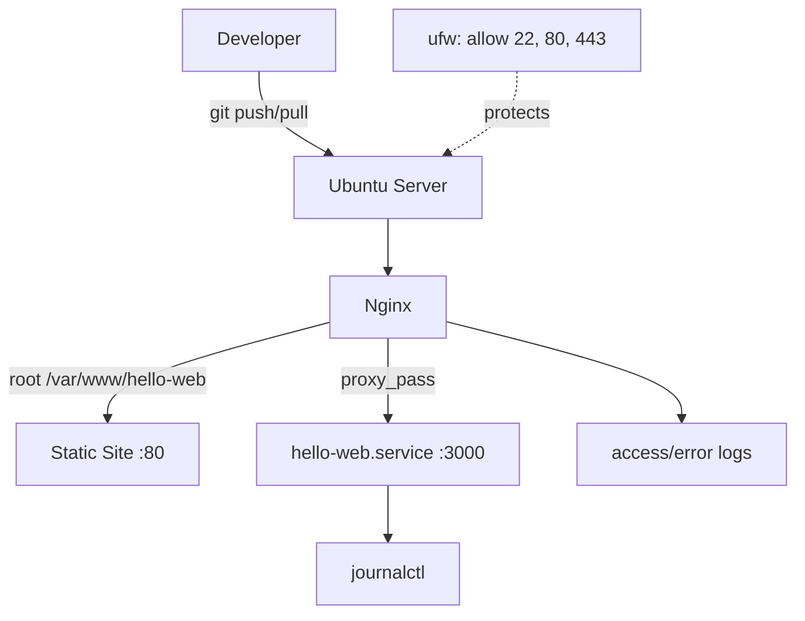

# Linux Nginx Server

Production-ready Linux + Nginx deployment — static site serving, reverse proxy, systemd supervision, and host hardening on Ubuntu.

## Overview

This repository provisions a minimal, secure web server on Ubuntu 22.04/24.04. It serves a static site via Nginx on port 80, optionally reverse-proxies `/api/` to a backend on `127.0.0.1:3000`, supervises that backend with systemd, and locks the host down with ufw and SSH hardening.

**Real-world problem it solves:** small teams need a reproducible, observable, and secure single-server deployment without managed platforms — where firewall rules, service supervision, and a git-based deploy workflow are explicit and auditable.

```
Browser --HTTP :80--> Nginx --/static--> /var/www/hello-web
                       \--proxy /api/--> 127.0.0.1:3000 (systemd)
```

## Architecture



**Layers:** Client/Browser → GitHub (source of truth) → Ubuntu → ufw → Nginx → `hello-web.service` (Python http.server demo) → logs.

Details: `docs/architecture.md`, `docs/architecture-decisions.md`.

## Technologies

| Technology | Purpose |
|---|---|
| Linux (Ubuntu 22.04/24.04) | Host OS, users, permissions, processes |
| Nginx | HTTP server + reverse proxy |
| systemd | Service supervision (`Restart=on-failure`) |
| ufw | Host firewall |
| SSH | Encrypted remote administration |
| Bash | Automation scripts |
| Git / GitHub | Versioned deploys |

## Features

- Static site serving from `/var/www/hello-web` with security headers (`X-Frame-Options`, `X-Content-Type-Options`, etc.) and `server_tokens off`
- Reverse proxy `location /api/` → `http://127.0.0.1:3000/` with `X-Forwarded-*` headers and timeouts
- Hardened systemd unit (`NoNewPrivileges`, `PrivateTmp`, `ProtectSystem=strict`, `ProtectHome`)
- Git-based deploy (`git pull --ff-only` + copy to web root + `nginx -t` + `reload`)
- Health checks with exit-code semantics for CI/cron

## Prerequisites

- Ubuntu 22.04 or 24.04 VM/VPS reachable over SSH
- `sudo` access
- Local machine with `git`, SSH client, text editor
- Bash (default on Ubuntu)

## Setup

```bash
# 1. On a fresh server (as sudo):
sudo bash scripts/install-server.sh
# installs nginx, git, curl, ufw; allows OpenSSH + Nginx Full; enables ufw

# 2. One-time site setup:
sudo bash scripts/setup.sh
# creates webuser, copies web/ to /var/www/hello-web, installs Nginx site, reloads

# 3. Optional backend (for /api):
sudo cp systemd/hello-web.service /etc/systemd/system/
sudo systemctl daemon-reload
sudo systemctl enable --now hello-web
sudo systemctl status hello-web --no-pager
```

Full walkthrough: `docs/setup.md`.

## Configuration

| File | Purpose |
|---|---|
| `nginx/hello-site.conf` | `listen 80 default_server`, `root /var/www/hello-web`, security headers, `client_max_body_size 1m` |
| `nginx/reverse-proxy.conf` | `location /api/ { proxy_pass http://127.0.0.1:3000/; ... }` |
| `systemd/hello-web.service` | `User=webuser`, `Restart=on-failure`, hardening flags |
| `scripts/install-server.sh` | Base packages + firewall |
| `scripts/setup.sh` | Web root + Nginx site symlink |

All scripts are `#!/usr/bin/env bash` with `set -euo pipefail`.

Validate:
```bash
chmod +x scripts/*.sh tests/smoke-test.sh
bash -n scripts/*.sh tests/smoke-test.sh
nginx -t
```

## Deployment

```bash
# From the repo directory on the server:
sudo bash scripts/deploy-site.sh   # git pull --ff-only + copy web/ + chown
curl -I http://127.0.0.1/          # expect HTTP/1.1 200
```

For reverse-proxy mode, symlink `reverse-proxy.conf` into `sites-enabled`, ensure `hello-web` is running, then `curl http://SERVER/api/`.

See `docs/deployment.md`.

## Testing

```bash
bash tests/smoke-test.sh          # checks systemd nginx active, curl 200, body contains Hello
bash scripts/healthcheck.sh       # usage: healthcheck.sh [URL] [EXPECTED_CODE] [TIMEOUT]
bash scripts/healthcheck.sh http://127.0.0.1/ 200 10
```

`smoke-test.sh` exits non-zero on failure — suitable for CI or cron.

## Monitoring / Logging

- Nginx access: `/var/log/nginx/access.log`
- Nginx error: `/var/log/nginx/error.log`
- Service logs: `journalctl -u nginx`, `journalctl -u hello-web`
- Live tail: `tail -f /var/log/nginx/access.log`

## Security

- ufw default deny, allows only `OpenSSH` and `Nginx Full` (22, 80, 443)
- SSH key-only auth, password auth disabled, root login disabled (see `docs/security.md`)
- Dedicated `webuser` for web root; services never run as root where possible
- No secrets in repo; `.env`, `*.pem`, `*.key` gitignored
- OS patching via `apt update && apt upgrade`

## Cleanup

```bash
sudo rm /etc/nginx/sites-enabled/hello-site /etc/nginx/sites-available/hello-site
sudo systemctl disable --now hello-web 2>/dev/null || true
sudo rm -rf /var/www/hello-web
sudo systemctl reload nginx
```

## Project Structure

```
linux-nginx-server/
├── README.md
├── docs/
│   ├── architecture.md
│   ├── architecture-decisions.md
│   ├── setup.md
│   ├── deployment.md
│   ├── security.md
│   ├── troubleshooting.md
│   ├── commands.md
│   └── interview-questions.md
├── diagrams/
│   ├── architecture.mmd
│   ├── architecture.drawio
│   └── flowchart.mmd
├── screenshots/
│   └── README.md
├── scripts/
│   ├── install-server.sh
│   ├── setup.sh
│   ├── deploy-site.sh
│   └── healthcheck.sh
├── nginx/
│   ├── hello-site.conf
│   └── reverse-proxy.conf
├── systemd/
│   └── hello-web.service
├── web/
│   ├── index.html
│   └── error/502.html
├── tests/
│   └── smoke-test.sh
└── .gitignore
```

## Future Improvements

- TLS with `certbot` (Let's Encrypt) and 80 → 443 redirect
- `fail2ban` + logrotate + uptime probe
- Upstream load balancing for multiple app hosts
- Ansible role to make the whole setup declarative
