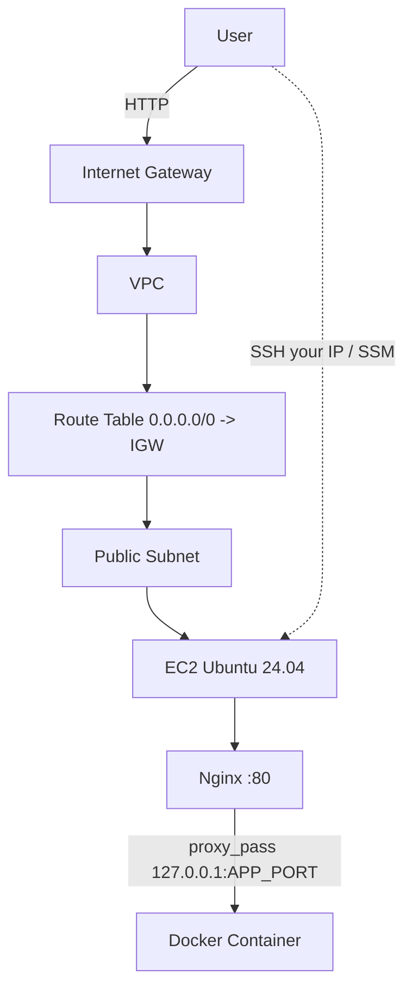

# Terraform AWS Infrastructure

Terraform-provisioned AWS stack — VPC, public subnet, security group, IAM role, EC2 (Ubuntu 24.04), Docker and Nginx via `user-data` — with a zero-dependency Node.js demo app.

## Overview

This repository codifies an entire AWS web stack in Terraform HCL. One `terraform apply` creates networking (VPC + Internet Gateway + route table), a public subnet, a least-privilege security group, an IAM role + instance profile (SSM + minimal S3 read), and an EC2 instance. At boot, `user-data.sh` installs Docker and Nginx, runs the demo container, and configures Nginx to reverse-proxy `80 → 127.0.0.1:APP_PORT`.

**Real-world problem it solves:** manual console click-ops are irreproducible and insecure — this makes infrastructure reviewable, versioned, and least-privilege by default.

```
Internet --80/443--> IGW --> VPC (10.0.0.0/16) --> Public Subnet (10.0.1.0/24) --> EC2 --> Nginx :80 --> Container :APP_PORT
                 \--22 (your IP only)-------------------------------------------------> EC2 SSH/SSM
```

## Architecture



Bootstrap: `user-data.sh` (Docker + Nginx + `docker run -p APP_PORT:INTERNAL_PORT` + Nginx site). See `docs/architecture.md`.

## Technologies

| Technology | Purpose |
|---|---|
| Terraform (HCL) | IaC: `terraform/` |
| AWS VPC, IGW, Route Table, Subnet | Networking |
| AWS Security Group | Firewall |
| AWS IAM Role + Instance Profile | Instance credentials (STS) + SSM |
| AWS EC2 (Ubuntu 24.04) | Compute |
| Docker | Container runtime |
| Nginx | Reverse proxy |
| Node.js | Demo app (`app/server.js`) |
| Bash / Make | Bootstrap and task automation |

## Features

- Canonical Ubuntu 24.04 AMI via `data.aws_ami` + AZ data source
- Encrypted `gp3` root volume, IMDSv2 required (`http_tokens=required`), `user_data_replace_on_change`
- Least-privilege SG (SSH your IP, HTTP/HTTPS public, app port private) and IAM (SSM + single-bucket S3 read)
- Templated `user-data.sh` (`${app_image}`, `${app_port}`) with security headers and `server_tokens off`
- Outputs `public_ip`, `public_dns`, `ssh_command`; `Makefile` wraps `init/fmt/validate/plan/apply/destroy/ssh/local-test`

## Prerequisites

- Terraform >= 1.5
- AWS CLI v2, `aws configure` with EC2/VPC/IAM permissions
- Existing EC2 key pair in target region
- Docker / Node 18+ optional for local test

## Setup

```bash
git clone <this-repo> && cd terraform-aws-infrastructure
cp terraform/terraform.tfvars.example terraform/terraform.tfvars
# edit: key_name, allowed_ssh_cidr (curl ifconfig.me -> YOUR_IP/32), region, instance_type
cd terraform
terraform init
terraform fmt -recursive && terraform validate
terraform plan
terraform apply   # type yes; expect 8 resources added, outputs public_ip
```

Full guide: `docs/setup.md`.

## Configuration

`terraform/terraform.tfvars` (gitignored):

```hcl
region              = "us-east-1"
key_name            = "terraform-demo"      # must exist in region
allowed_ssh_cidr    = "203.0.113.5/32"      # YOUR IP only; required, validated as CIDR
instance_type       = "t3.micro"
vpc_cidr            = "10.0.0.0/16"
public_subnet_cidr  = "10.0.1.0/24"
app_image           = "nginx:latest"        # pullable from Docker Hub
app_port            = 3000
app_internal_port   = 80
```

Variables documented in `terraform/variables.tf`; example in `terraform.tfvars.example`.

## Deployment

**Local (no AWS):**

```bash
make local-test           # docker build -t terraform-demo-app ./app && docker run -p 3000:3000
# or
cd app && npm start       # http://localhost:3000
curl http://localhost:3000/health  # {"status":"ok"}
```

**AWS:**

```bash
cd terraform
terraform output -raw public_ip   # curl http://<ip>/  and  http://<ip>/health
make ssh                          # uses key from terraform.tfvars
cat /tmp/user-data-complete.log   # USER DATA COMPLETE
```

See `docs/deployment.md` and `terraform/README.md`.

## Testing

```bash
terraform validate
terraform fmt -check -recursive
cd app && node server.js --selftest   # boots on random port, checks /health, SELFTEST PASS
curl http://<public_ip>/health        # after apply
```

## Monitoring / Logging

- EC2: `systemctl status`, `journalctl -u cloud-final`, `/var/log/cloud-init-output.log`, `journalctl -u nginx`, `docker logs app`
- Probe: `curl -s http://<ip>/health | jq`
- Terraform: `terraform state list`, `terraform state show`, `terraform plan` (drift detection)

## Security

- `terraform.tfvars`, `*.tfstate*`, `*.pem`, `*.key`, `.env` gitignored; only `*.example` committed
- IAM role via instance profile (STS, no static keys); SSM (`AmazonSSMManagedInstanceCore`) for keyless access
- SG: SSH your IP only (validated CIDR), 80/443 public, app port private
- Encrypted EBS, IMDSv2; Nginx `server_tokens off` + security headers
- For production: S3 backend + DynamoDB locking, Secrets Manager/Parameter Store, TLS (ACM/ALB or certbot)

## Cleanup

```bash
cd terraform
terraform destroy            # type yes; verify VPC/instance gone in console
# Local Docker
docker rm -f app 2>/dev/null || true
```

Stopped instances still incur EBS charges — prefer `destroy` over `stop` after demo.

## Project Structure

```
terraform-aws-infrastructure/
├── README.md
├── Makefile
├── .gitignore
├── app/
│   ├── Dockerfile
│   ├── package.json
│   └── server.js
├── terraform/
│   ├── provider.tf
│   ├── versions.tf
│   ├── variables.tf
│   ├── vpc.tf
│   ├── subnet.tf
│   ├── security-group.tf
│   ├── iam.tf
│   ├── ec2.tf
│   ├── outputs.tf
│   ├── user-data.sh
│   ├── terraform.tfvars.example
│   └── README.md
├── docs/
├── diagrams/
└── screenshots/
```

## Future Improvements

- S3 backend + DynamoDB locking, workspaces for `dev/staging/prod`
- ALB + Auto Scaling Group, private subnet + NAT
- TLS via ACM + ALB, `pre-commit` hooks (`fmt -check`, `validate`), Packer golden AMI, CloudWatch alarms
